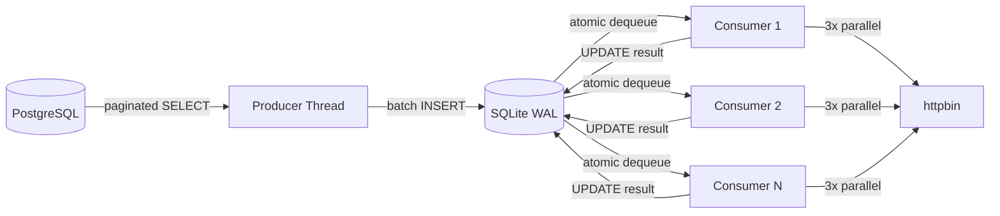
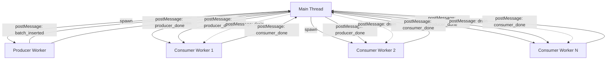
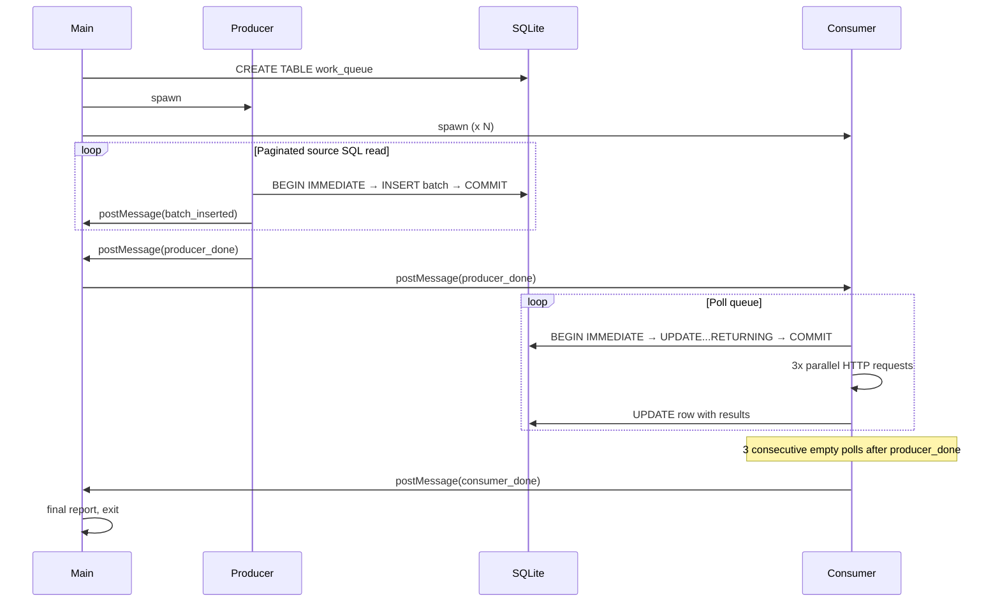
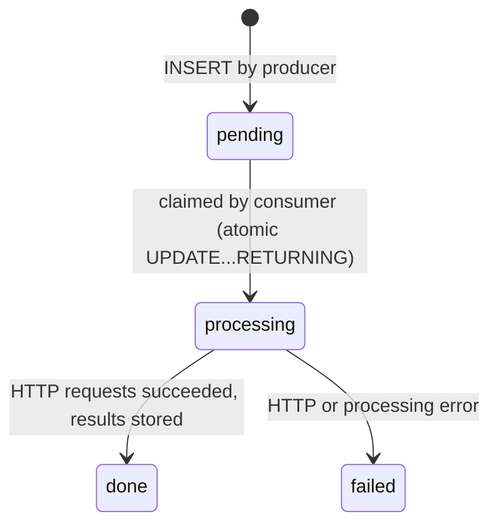
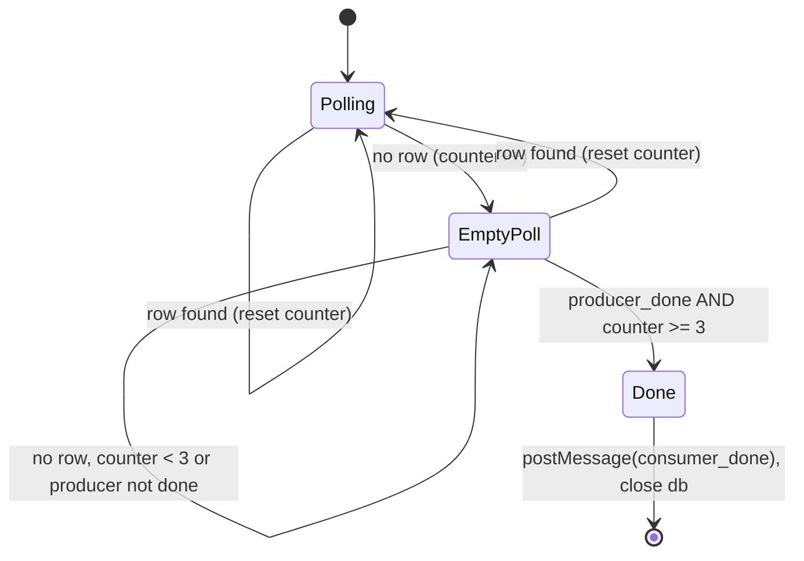
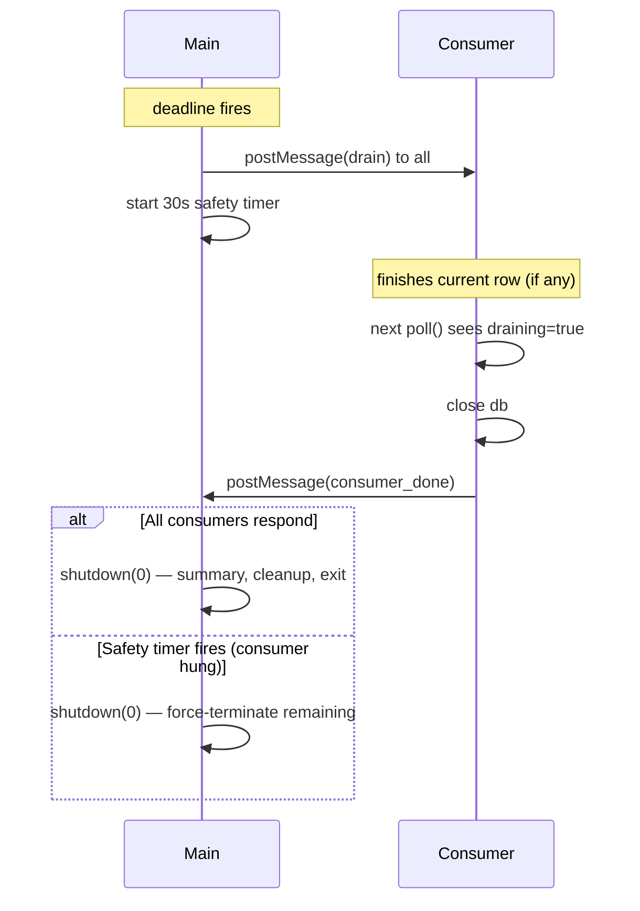

# js-sqlite-workers

A multi-threaded Node.js pipeline that reads rows from PostgreSQL, queues them in an ephmermeral SQLite file, and processes each row through parallel HTTP requests — using `worker_threads` for true concurrent execution across CPU cores.

## Architecture

The system follows a producer–consumer pattern with SQLite as a durable work queue sitting between the two stages. The main thread orchestrates lifecycle and progress monitoring but performs no data processing itself.



### Thread model

All threads run within a single OS process but execute on separate CPU cores via Node.js `worker_threads`. Each worker gets its own V8 isolate and event loop. Communication between threads uses `postMessage`.



## Pipeline lifecycle



## Work queue state machine

Each row in `work_queue` transitions through a linear state machine. Failed rows are terminal — no automatic retry.



## SQLite concurrency strategy

SQLite is single-writer. The system handles this through:

| Mechanism | Purpose |
| --------- | ------- |
| WAL mode | Allows concurrent reads during writes — consumers can dequeue while the producer inserts |
| `BEGIN IMMEDIATE` | Acquires the write lock upfront, avoiding deadlocks from read-to-write lock upgrades |
| `busy_timeout = 5000` | Retries internally for up to 5 seconds when the write lock is held by another thread |
| `SQLITE_BUSY` backoff | If `busy_timeout` is exceeded, the consumer backs off 200ms and retries |
| Atomic dequeue | `UPDATE ... WHERE id = (SELECT id ... LIMIT 1) RETURNING *` claims and returns a row in one statement — no two consumers can claim the same row |

Each thread opens its own `better-sqlite3` connection. Connections are not shared across threads.

## Shutdown and graceful drain

### Normal completion

Consumers cannot simply exit when the queue is empty — the producer may still be inserting rows. A naive "exit on empty poll" would race against in-flight batch inserts.

The shutdown protocol requires two conditions:

1. The main thread relays `producer_done` to all consumers once the producer signals completion
2. A consumer only exits after receiving `producer_done` **and** observing 3 consecutive empty polls



The 3-poll guard exists because `producer_done` can arrive between batch inserts — a single empty poll immediately after the message is not proof that the queue is fully drained. Three consecutive empty polls (each 200ms apart) provides sufficient confidence that no more rows are in flight.

### Deadline drain (`--max-duration`)

When the deadline timer fires, the pipeline uses a two-phase approach instead of immediately terminating workers. This lets in-flight HTTP requests complete so rows don't get stuck in `processing`.



The `drain` message reuses the same `postMessage` channel as `producer_done`. When a consumer sees the flag, it stops dequeuing new rows but any in-flight work (HTTP calls from the previous poll iteration) completes normally before the flag is checked. The 30-second safety timer ensures the pipeline always exits even if a consumer hangs on a slow request.

## Project structure

```text
src/
├── index.js      Main thread — orchestration, progress polling, shutdown
├── config.js     CLI flags (parseArgs) and environment variable defaults
├── logger.js     Pino logger factory with pino-pretty transport
├── db.js         SQLite connection factory and schema initialisation
├── producer.js   Worker thread — PG paginated read → SQLite batch insert
└── consumer.js   Worker thread — SQLite dequeue → HTTP fan-out → result store

docker/
└── init.sql      Seeds PostgreSQL with 100k rows across 5 departments

docker-compose.yml    PostgreSQL 16 + go-httpbin
```

## Prerequisites

- Node.js >= 18
- Docker and Docker Compose

## Setup

```bash
npm install
npm run db:up        # starts PostgreSQL and httpbin containers
sleep 3              # wait for PostgreSQL to accept connections
```

## Usage

```bash
npm start -- [options]
```

### CLI flags

| Flag | Short | Default | Description |
| ---- | ----- | ------- | ----------- |
| `--consumers` | `-c` | `4` | Number of consumer worker threads |
| `--batch-size` | `-b` | `100` | PostgreSQL page size for producer reads |
| `--limit` | `-l` | `0` | Maximum rows to process (0 = unlimited) |
| `--max-duration` | `-t` | `0` | Maximum pipeline runtime in seconds (0 = unlimited) |

### Environment variables

| Variable | Default | Description |
| -------- | ------- | ----------- |
| `PG_HOST` | `localhost` | PostgreSQL host |
| `PG_PORT` | `5432` | PostgreSQL port |
| `PG_USER` | `postgres` | PostgreSQL user |
| `PG_PASSWORD` | `postgres` | PostgreSQL password |
| `PG_DATABASE` | `workqueue` | PostgreSQL database |
| `HTTPBIN_URL` | `http://localhost:8080` | Target URL for consumer HTTP requests |
| `LOG_LEVEL` | `info` | Pino log level (`debug`, `info`, `warn`, `error`, `fatal`) |
| `MOCK_CPU_LOAD` | `false` | Set to `true` to add synthetic CPU load per consumer row (BigInt fibonacci) |

### Examples

```bash
# Default: 4 consumers, batch size 100, all rows
npm start

# 3 consumers, small batches, limited to 20 rows
npm start -- -c 3 -b 5 -l 20

# Stop after 30 seconds, draining in-flight work gracefully
npm start -- -c 4 -b 100 -t 30

# Debug logging
LOG_LEVEL=debug npm start -- -c 2 -l 10

# Suppress info, only warnings and errors
LOG_LEVEL=warn npm start -- -c 4

# Demonstrate multi-core utilisation by calculating fibonaci sequences
MOCK_CPU_LOAD=true npm start -- -c 4 -b 100 -l 200
```

## Pipeline summary

On shutdown the main thread prints a summary report to stdout with row counts, HTTP latency percentiles, and total pipeline duration:

```text
  PIPELINE SUMMARY

  rows_done ··························· 200
  rows_failed ························· 0
  rows_total ·························· 200

  http_call_1_duration ················ avg=297ms     min=175ms     med=289ms     max=591ms     p(90)=387ms   p(95)=436ms
  http_call_2_duration ················ avg=295ms     min=166ms     med=286ms     max=583ms     p(90)=396ms   p(95)=421ms
  http_call_3_duration ················ avg=302ms     min=163ms     med=295ms     max=648ms     p(90)=393ms   p(95)=432ms
  http_call_duration ·················· avg=298ms     min=163ms     med=290ms     max=648ms     p(90)=391ms   p(95)=430ms

  consumers ··························· 4
  pipeline_duration ··················· 18.19s
```

The summary is printed regardless of whether the pipeline completed normally or was stopped by `--max-duration`. Any rows left in `processing` at shutdown are reset to `pending` so they can be identified in the database.

## Querying results

Because every HTTP response is persisted to SQLite — status code, body, and duration per request — the output database is a self-contained artefact that can be queried post-run without any external dependencies. Open it with any SQLite client (`sqlite3`, DBeaver, Datasette, etc.) and run ad-hoc analysis.

Failed rows:

```sql
SELECT id, source_id, payload FROM work_queue WHERE status = 'failed';
```

Slow responses (any of the 3 requests exceeding 500ms):

```sql
SELECT id, source_id,
       result_1_duration_ms, result_2_duration_ms, result_3_duration_ms
FROM work_queue
WHERE result_1_duration_ms > 500
   OR result_2_duration_ms > 500
   OR result_3_duration_ms > 500;
```

Non-200 HTTP status codes:

```sql
SELECT id, source_id,
       result_1_status, result_2_status, result_3_status
FROM work_queue
WHERE result_1_status != 200
   OR result_2_status != 200
   OR result_3_status != 200;
```

Missing responses (row was claimed but never completed):

```sql
SELECT id, source_id, processed_at
FROM work_queue
WHERE status = 'processing';
```

Aggregate latency distribution:

```sql
SELECT
  ROUND(AVG(result_1_duration_ms + result_2_duration_ms + result_3_duration_ms), 1) AS avg_total_ms,
  MAX(result_1_duration_ms + result_2_duration_ms + result_3_duration_ms) AS max_total_ms,
  MIN(result_1_duration_ms + result_2_duration_ms + result_3_duration_ms) AS min_total_ms
FROM work_queue
WHERE status = 'done';
```

Status breakdown:

```sql
SELECT status, COUNT(*) AS count FROM work_queue GROUP BY status;
```

This approach avoids parsing logs for post-mortem analysis. The database file is portable, can be committed to a test artefact store, or diffed between runs.

## Network latency simulation

The PostgreSQL container supports injecting artificial network latency via `tc` (traffic control). This is useful for observing how producer batch size affects throughput under high-latency conditions.

```bash
npm run db:latency       # adds 50ms delay to all PostgreSQL traffic
npm run db:no-latency    # removes the delay
```

Requires the `NET_ADMIN` capability, which is granted in the compose file.

## Teardown

```bash
npm run db:down          # stops containers and removes volumes
```
